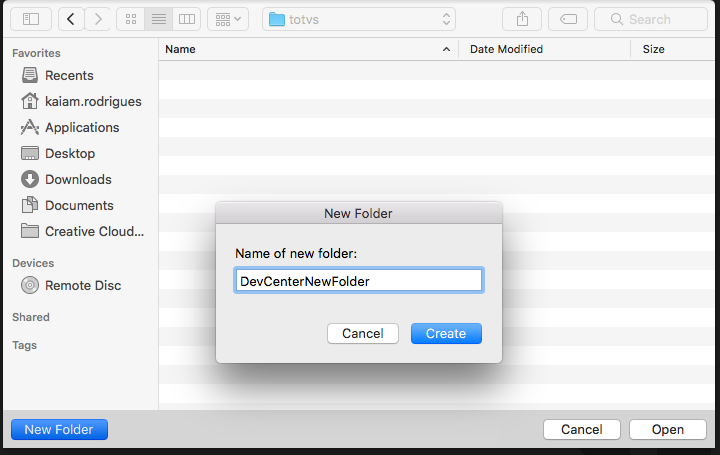
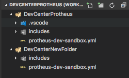

# TOTVS Protheus Dev SandBox Extension for VSCode

### The purpose of this extension is to make your Protheus experience easier. With just few commands you will prepare your dev environment.

How does it happen?

Our Docker Ninjas has turned the Protheus environment in a containered place. All the important fragments of this big ecosystem was encapsulated and, after this, an image was created and published on a TOTVS registry.

---
What are the requirenment to use this?

 - [Docker](https://www.docker.com)
 - [ADVPL](http://tdn.totvs.com/display/tec/AdvPL) 
 - [ADVPL Extension for VSCode](https://marketplace.visualstudio.com/items?itemName=KillerAll.advpl-vscode) 

---

## Step 1: Add compose file:

1. Launch Code;
2. From the command palette `Ctrl`-`Shift`-`P` (Windows, Linux) or `Cmd`-`Shift`-`P` (OSX);
3. Select `TOTVS - Protheus Dev SandBox - Create Docker Compose`.

The process indicated above will create on your computer a `protheus-dev-sandbox.yml` file.

Now, when you select the directory, two options will appear in this command:

### Current:

If you choose the **current** workspace, all the existed folders will be listed

After you choose your destination, it's time to decide if you want to import the Protheus includes files:

Select the folder's destination and after that the process will be finished.

### New Directory:

If you opt for **new Directory**, a navigation window will open:

Create your new folder:

Next, it's time to decide if you want to import the Protheus includes files:

## Step 2: Create VSCode Settings with ADVPL parameters:
To compile your code in Protheus RPO, you need the [ADVPL Extension for VSCode](https://marketplace.visualstudio.com/items?itemName=KillerAll.advpl-vscode) 

1. Launch Code;
2. From the command palette `Ctrl`-`Shift`-`P` (Windows, Linux) or `Cmd`-`Shift`-`P` (OSX);
3. Select `TOTVS - Protheus Dev SandBox - Create VSCode Settings`.

Select your folder:

## Step 3: Launching the Protheus:

In your terminal, type this:

`docker-compose -f protheus-dev-sandbox.yml up`

Wait for all services load... 

Now, go to `http://localhost:8080` on your favorite browser.

First login:
Username: ADMIN
Password: admin

Enjoy!
